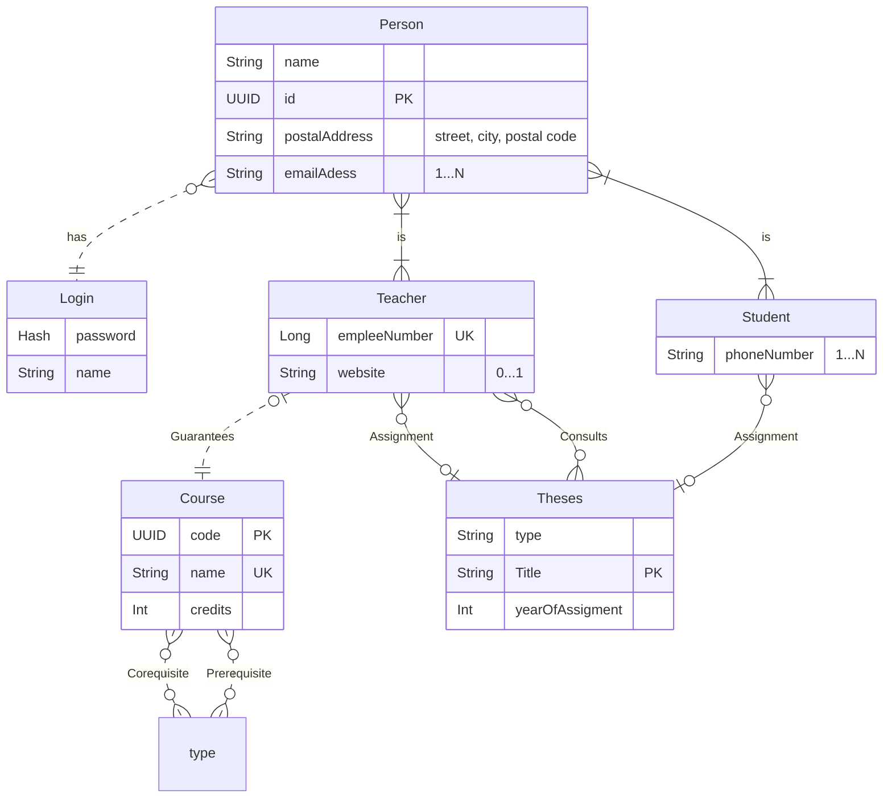

Student information system

```mermaid
erDiagram
    Person {
        String name 
        UUID id PK
        String postalAddress "street, city, postal code"
        String emailAdess "1...N"
    }

    Person }o..|| Login : has
    Person }|--|{ Teacher : is
    Person }|--|{ Student : is

        Student {
            String phoneNumber "1...N"
        }
        
        Teacher {
            Long empleeNumber UK
            String website "0...1"
        }
        
            Teacher |o..|| Course : Guarantees

            Course {
                UUID code PK
                String name UK
                Int credits
            }
                
                %%Recursive link 
                Course }o..o{ type : Corequisite
                Course }o..o{ type : Prerequisite
    
            Student }o--o| Theses : Assignment
            Teacher }o--o| Theses : Assignment

            Teacher }o--o{ Theses : Consults
            
            Theses {
                String type
                String Title PK
                Int yearOfAssigment
            }
        
        Login {
            Hash password
            String name
        }
```