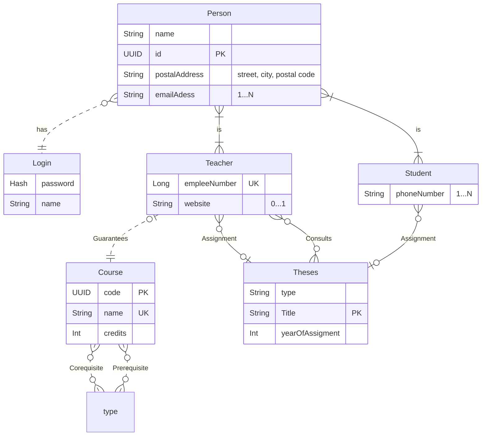

# Labs

## Lab 02

### Entity relationship model



## Lab 03

### Relationship model

## Lab 05

### Functional relations
    It's like logic in math all over again.
    You will be looking for relations.

## Lab 06

### SQL 

#### Writing SQL queries for the lab

```sql
    CREATE TABLE book(
        bookId INTEGER PRIMARY KEY ,
        ISBN VARCHAR(17) NOT NULL UNIQUE,
        name VARCHAR(100) NOT NULL,
        author VARCHAR(100) NOT NULL,
        publisher VARCHAR(100) NOT NULL,
        year SMALLINT NOT NULL 
             CHECK (year >= 1445 AND year <= EXTRACT(YEAR FROM CURRENT_DATE)),
        annotation TEXT,
        CONSTRAINT book_unique UNIQUE (author, publisher, year)
    );

--    insert two books into the table by different method
    INSERT INTO book (bookId, ISBN, name, author, publisher, year, annotation)
    VALUES (1, '978-3-16-148410-0', 'The Art of Computer Programming', 'Donald Knuth', 'Addison-Wesley', 1968, 'The Art of Computer Programming is a comprehensive monograph written by Donald Knuth that covers many kinds of programming algorithms and their analysis.');
    INSERT INTO book VALUES (2, '978-0-13-110362-7', 'Introduction to the Theory of Computation', 'Michael Sipser', 'Cengage Learning', 2006, 'Introduction to the Theory of Computation is a comprehensive monograph written by Michael Sipser that covers many kinds of programming algorithms and their analysis.');

--     write out all books
    SELECT *
        FROM book

--     write out all books, constrain columns to ISBN, name and year
    SELECT ISBN, name, year
        FROM book
    
--     write out all books published in year 2024, constrain columns to ISBN and name
    SELECT ISBN, name
        FROM book
        WHERE year = 2024
        
--     write out all books published in year 2024 or 2017
--     constrain columns to ISBN, name and year
--     order primarily by year from the newest to the oldest, and secondarily by name
    SELECT ISBN, name, year
        FROM book
        WHERE year = 2024 OR year = 2017
        ORDER BY year DESC, name
    
--     add new collumn to the table
    ALTER TABLE book
        ADD COLUMN URL VARCHAR(100) NOT NULL UNIQUE;
    UPDATE book
        SET URL = 'https://www.example.com'
        WHERE bookId = 1;
    UPDATE book
        SET URL = 'https://www.examplebutdifferent.com'
        WHERE bookId = 2;

-- create new table for Author and Authorship
    CREATE TABLE author(
        authorId INTEGER PRIMARY KEY,
        name VARCHAR(100) NOT NULL UNIQUE
    );
    CREATE TABLE authorship(
        authoId INTEGER NOT NULL,
        bookId INTEGER NOT NULL,
        PRIMARY KEY (authorId, bookId),
        CONSTRAINT fk_author FOREIGN KEY (authorId) REFERENCES author(authorId),
        CONSTRAINT fk_book FOREIGN KEY (bookId) REFERENCES book(bookId)
    );

-- insert authors into the table
    INSERT INTO author (authorId, name)
    VALUES (1, 'Donald Knuth');
    INSERT INTO author (authorId, name)
    VALUES (2, 'Michael Sipser');
-- insert authorship into the table
    INSERT INTO authorship (authorId, bookId)
    VALUES (1, 1);
    INSERT INTO authorship (authorId, bookId)
    VALUES (2, 2);

-- inset authr with more then one book
    INSERT INTO author VALUES (3, 'J. K. Rowling');
    INSERT INTO book VALUES (3, '978-0-7475-3269-6', 'Harry Potter and the Philosopher''s Stone', 'Bloomsbury', 1997, 'Harry Potter and the Philosopher''s Stone is a fantasy novel written by British author J. K. Rowling.');
    INSERT INTO book VALUES (4, '978-0-7475-3269-6', 'Harry Potter and the Chamber of Secrets', 'Bloomsbury', 1998, 'Harry Potter and the Chamber of Secrets is a fantasy novel written by British author J. K. Rowling.');
    INSERT INTO authorship VALUES (3, 3);
    INSERT INTO authorship VALUES (3, 4);

-- write out all books from J. K. Rowling
    SELECT b.ISBN, b.name, b.year
        FROM book b
        JOIN authorship a ON b.bookId = a.bookId
        JOIN author au ON a.authorId = au.authorId
        WHERE au.name = 'J. K. Rowling'
        ORDER BY b.year DESC, b.name

-- edit each Id so that it autoincrements
    ALTER TABLE book
        ALTER COLUMN bookId SET GENERATED ALWAYS AS IDENTITY;
    ALTER TABLE author
        ALTER COLUMN authorId SET GENERATED ALWAYS AS IDENTITY;
    ALTER TABLE authorship
        ALTER COLUMN authorId SET GENERATED ALWAYS AS IDENTITY;
    ALTER TABLE authorship
        ALTER COLUMN bookId SET GENERATED ALWAYS AS IDENTITY;

-- create table for genres
    CREATE TABLE genre(
        genreId INTEGER PRIMARY KEY,
        name VARCHAR(100) NOT NULL UNIQUE
        subGenreId INTEGER REFERENCES genre(genreId)
    );

-- add genres and subGenres to book
    ALTER TABLE book
        ADD COLUMN genreId INTEGER NOT NULL CHECK (genreId <> subGenreId) REFERENCES genre(genreId);
    ALTER TABLE book
        ADD COLUMN subGenreId INTEGER REFERENCES genre(genreId);

-- create few genres
    INSERT INTO genre (genreId, name)
    VALUES (1, 'Computer Science', NULL);
    INSERT INTO genre (genreId, name)
    VALUES (2, 'Mathematics', NULL);
    INSERT INTO genre (genreId, name, subGenreId)
    VALUES (3, 'Algebra', 2);
    INSERT INTO genre (genreId, name, subGenreId)
    VALUES (4, 'Calculus', 2);

-- update single book with genre
    UPDATE book
        SET genreId = 1, subGenreId = 2
        WHERE ISBN = '978-3-16-148410-0';

-- delete only single book
    DELETE FROM book
        WHERE ISBN = '978-0-13-110362-7';

-- delete everything
    DROP TABLE authorship;
    DROP TABLE author;
    DROP TABLE book;
    DROP TABLE genre;
```
    

